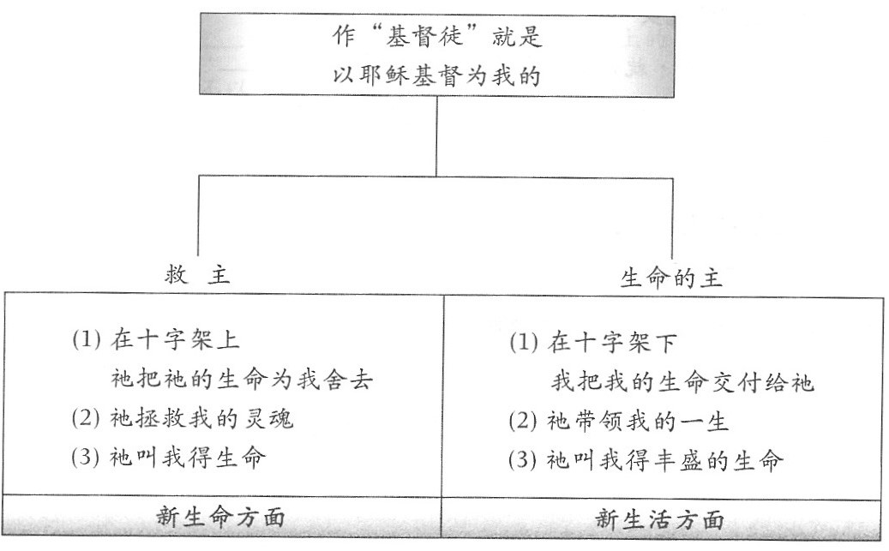

# 基督徒的新生活

背誦經文：
+ [約翰福音15:5](https://www.biblegateway.com/passage/?search=約翰福音15:5&version=CUVMPS)
+ [加拉太書2:20](https://www.biblegateway.com/passage/?search=加拉太書2:20&version=CUVMPS)

# 查经

一、我是谁  

“我是谁？”你是否曾经认真思考过这个问题？你也许同时拥有多种身分，但使你最为自豪的是哪一个身分？为什么？

每一个重生得救的人都拥有两种身分。一个是属世的身分，那是短暂且会朽坏的;另一个则是属天的身分，是主耶稣基督借着祂在十字架上的救赎为我们赢得的，那就是我们的“基督徒”身分。

门徒被称为“基督徒"是在第一世纪从安提阿开始。从那以后，凡接受耶稣基督为个人的救主和生命的主，并立志顺服祂的人，都被称为“基督徒”。从初期教会到如今的近2000年里，有多少人为了它赴汤蹈火，甘愿受逼迫;又有多少人用自己的生命来捍卫“基督徒”这宝贵的身分。

当我们成为“基督徒" ，我们就成为基督的朋友，主的门徒，我们的身体成为圣灵的殿，我们的生命从此改变。我们当为自己拥有“基督徒"的身分而欢欣、自豪。
  
二、作基督徒的含义  

1．基督降世救人的目的:  

“我(主耶穌)來了，是要叫羊(人)▁▁▁▁，并且▁▁▁▁。[约10.10](https://www.biblegateway.com/passage/?search=约10.10&version=CUVMPS)  

从这里我们可以看出主耶稣对我们的心意：  
　1) 要叫我们得生命；相信耶稣，以祂为救主。  
　2) 要叫我们得更丰盛的生命；倚靠耶稣，以祂为生命的主。

2．作基督徒的含义:  
  

如此看来，作“基督徒”是我与主进行生命的交換、交流和交托这也是使徒保罗的亲身经历。他在往大马士革途中见到主后，成为一个新人，不再按自己旧有的理想、喜好来决定自己的前途人生，而是把自己完全奉献给主，让主大大地差遣、使用。我们也应把我们的生命完全交交托给主耶穌，让祂带领我们的一生。  
"我已经与基督▁▁▁▁，现在活着的不再是▁▁▁▁，乃是▁▁▁▁在我里面活着，祂是▁▁▁▁，为我▁▁▁▁。[加2.20](https://www.biblegateway.com/passage/?search=加2.20&version=CUVMPS)  

3．基督徒的10种身份  

+ 蒙神呼召，从世界中分别出来的人:  
他们▁▁▁▁▁▁▁，正如我▁▁▁▁▁▁。求你用真理使他们▁▁▁▁▁，你的道就是真理。[约17.16-17](https://www.biblegateway.com/passage/?search=约17.16-17&version=CUVMPS)  

你们若▁▁▁▁▁▁，世界必爱属自己的；只因你们▁▁▁▁▁▁，乃是我从世界中▁▁▁▁了你们，所以世界就恨你们。[约15.19](https://www.biblegateway.com/passage/?search=约15.19&version=CUVMPS)  

这里的“世界"，指的是魔鬼掌权的这一充满罪恶的幽暗世界。“从世界中分别出来”指的是我们虽然生活在这个世界上，但不属于这个世界，也不随从这世界的风俗。

+ 神的儿女:  
凡▁▁▁▁祂的，就是信祂名的人，祂就赐他们▁▁▁▁，作▁▁▁▁。这人不是从血气生的，不是从情欲生的，也不是从人意生的，乃是从▁▁▁▁生的。” [约1.12-13](https://www.biblegateway.com/passage/?search=约1.12-13&version=CUVMPS)  

+ 基督的门徒:  
在主耶稣时代，“门徒”指的是跟从老师，并遵守祂的教导和生活方式的人。我们作主的门徒，就是要跟从祂，效法祂。  
“耶稣对他们说：‘来▁▁▁我！我要叫你们▁▁如得鱼一样。’他们就立刻舍了网，▁▁▁▁了祂。"[太4.19-20](https://www.biblegateway.com/passage/?search=太4.19-20&version=CUVMPS)

+ 基督的朋友:  
非常感谢主，祂不仅给了我们基督徒的身分，而且使我们成为祂的朋友。  
“你们若▁▁▁▁我所吩咐的，就是我的▁▁▁▁了。以后我不再称你们为▁▁▁▁，因仆人不知道主人所作的事；我乃称你们为▁▁▁▁，因为我从我父所听见的，已经都告诉你们了。"[约15.14-15](https://www.biblegateway.com/passage/?search=约15.14-15&version=CUVMPS)

+ 基督的肢体:  
“正如我们一个身体上有好些▁▁▁▁，▁▁▁▁也不都是一样的用处。我们这许多人，在基督里成为一身，互相联络作▁▁▁▁，也是如此。”[罗12.4-5](https://www.biblegateway.com/passage/?search=罗12.4-5&version=CUVMPS)

+ 圣灵的殿:  
"岂不知你们的身子就是▁▁▁▁▁吗？这圣灵是从神而来，住在你们▁▁▁▁的。”[林前6.19](https://www.biblegateway.com/passage/?search=林前6.19&version=CUVMPS)

+ 天上的国民:  
“我们却是天上的▁▁▁▁，并且▁▁▁▁救主，就是主耶稣基督从天上降临。”[腓3.20](https://www.biblegateway.com/passage/?search=腓3.20&version=CUVMPS)

+ 地上的客旅:  
“亲爱的弟兄啊，你们是▁▁▁▁，是▁▁▁▁的。”[彼前2.11](https://www.biblegateway.com/passage/?search=彼前2.11&version=CUVMPS)  
“他们却▁▁▁▁一个更美的▁▁▁▁，就是在天上的。所以神被称为他们的神，并不以为耻，祂已经给他们预备了▁▁▁▁。”[来11.16](https://www.biblegateway.com/passage/?search=来11.16&version=CUVMPS)  
真正的基督徒从不认为他们永远的盼望会在这地上，他们却羡慕荣美的家乡——天国。的确，我们基督徒只是这世上的客旅。我们永远的归宿是在天上。

+ 被基督派遣到世上的人:  
“你(父神)怎样▁▁▁我到世上，我也照样▁▁▁他们到▁▁▁。”[约17.18](https://www.biblegateway.com/passage/?search=约17.18&version=CUVMPS)

+ 基督的执事，神奥秘事的管家:  
"人应当以我们所为▁▁▁▁▁▁，为▁▁▁▁▁▁，所求于管家的，是要他有▁▁▁▁▁。”[林前4.1-2](https://www.biblegateway.com/passage/?search=林前4.1-2&version=CUVMPS)

四、基督徒的新生活

基督徒的新生活可以简单概括为“我在基督里的生活，基督在我里面的生活”。这种新生活具体表现在以下3个方面。

1．顺服基督的生活
我们是基督徒，基督是我们的救主和生命的主。所以，我们只有顺服主耶穌基督，才能在自己的生活中体验到神的大能和大爱。顺服就是要屈身行在神的旨意当中。主耶稣对神的顺服是我们最好的榜样。  
“父啊，你若愿意，就把这杯撤去，然而，不要成就▁▁▁▁▁▁，只要成就▁▁▁▁▁▁。” [路22.42](https://www.biblegateway.com/passage/?search=路22.42&version=CUVMPS)  
“祂虽然为儿子，还是因所受的苦难学了▁▁▁▁。祂既得以完全，就为凡▁▁▁▁祂的人成了永远得救的根源。”[来5.8-9](https://www.biblegateway.com/passage/?search=来5.8-9&version=CUVMPS)

2．灵命长进的生活  
“基督徒”因信主耶稣而得以重生，理应在基督里更新变化，不断长进，过一个得胜的基督徒生活。  
“直等到我们众人在真道上同归于一，认识神的儿子，得以▁▁▁▁，满有基督▁▁▁▁的身量，使我们不再作▁▁▁▁，中了人的诡计和欺骗的法术，被一切异教之风摇动，飘来飘去，就随从各样的异端。”[弗4.13-14](https://www.biblegateway.com/passage/?search=弗4.13-14&version=CUVMPS)

3．多结果子的生活
神从这世界中拣选了我们，让我们作祂的门徒，是要我们分别为圣，多結果子，荣耀归神。  
“你们▁▁▁▁▁▁，我父就因此得荣耀，你们也就是我的门徒了。”[约15.8](https://www.biblegateway.com/passage/?search=约15.8&version=CUVMPS)

五、基督徒要结出的果子

+ 仁义的果子:  
“使你们能分别是非，作诚实无过的人，直到基督的日子；并靠着耶稣基督结满了▁▁▁▁，叫荣耀称赞归与神。”[腓1.10-11](https://www.biblegateway.com/passage/?search=腓1.10-11&version=CUVMPS)

+ 光明的果子:  
"从前你们是暗昧的，但如今在主里面是▁▁▁▁的，行事为人就当像光明的子女。光明所结的果子就是一切▁▁▁▁、▁▁▁▁、▁▁▁▁。”[弗5.8-9](https://www.biblegateway.com/passage/?search=弗5.8-9&version=CUVMPS)

+ 圣灵的果子:  
"圣灵所结的果子，就是▁▁▁、▁▁▁、▁▁▁、▁▁▁、▁▁▁、▁▁▁、▁▁▁、▁▁▁、▁▁▁。这样的事，没有律法禁止。”[加5.22](https://www.biblegateway.com/passage/?search=加5.22&version=CUVMPS)

+ 传福音的果子:  
“但圣灵降临在你们身上，你们就必得着▁▁▁;并要在耶路撒冷、犹太全地和撒玛利亚，直到地极，作▁▁▁。"[徒1.8](https://www.biblegateway.com/passage/?search=徒1.8&version=CUVMPS)  

>结果子的秘诀
>1. 常在基督里：  
“我是葡萄树，你们是枝子；常在▁▁▁▁，我也常在祂里面，这人就▁▁▁▁▁；因为离了我，你们就不能作什么。”[约15.5](https://www.biblegateway.com/passage/?search=约15.5&version=CUVMPS)
>2. 勇于牺牲自己：  
我实实在在地告诉你们：一粒麦子不落在地里▁▁▁▁了，仍旧是一粒；若是▁▁▁了，就▁▁▁许多子粒来。”[约12.24](https://www.biblegateway.com/passage/?search=约12.24&version=CUVMPS)
