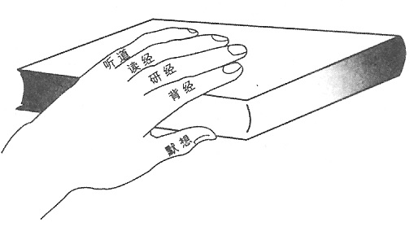

# 新生活与读经

背诵经文:
+ [约书亚记1:8](https://www.biblegateway.com/passage/?search=约书亚记1:8&version=CUVMPS)
+ [提摩太后书3:16,17](https://www.biblegateway.com/passage/?search=提摩太后书3:16,17&version=CUVMPS)

《圣经》是神启示给人类的话语。40多位不同身分的作者，同受一位圣灵的感动，从公元前1430年到公元90年左右，历经1500多年编写完成。

《圣经》是用希伯来文、亚兰文、希腊文3种文字写成的。《旧约》除了《但以理书》和《以斯拉记》的部分内容是用亚兰文写成以外，其余的37卷都是用希伯来文写成的。《新约》则全是用希腊文写成的。

神把《圣经》作为礼物赐给了人类，这并不是为了提高人类的学问或修养，乃是要使人明白神的救恩真理，并为神的儿女们提供在基督里过新生活所需的各项行动指南。

一、神的話語 — 聖經
1. 聖經的來源及意義  
來源：[提摩太後書3:15](https://www.biblegateway.com/passage/?search=提摩太後書3:15&version=CUVMPS)  
意義：[提摩太後書3:16-17](https://www.biblegateway.com/passage/?search=提摩太後書3:16-17&version=CUVMPS)  

2. 整本聖經的中心人物  
　[約翰福音5:39](https://www.biblegateway.com/passage/?search=約翰福音5:39&version=CUVMPS)

3. 基督徒對聖經應有的態度  
　[彼得前書2:2](https://www.biblegateway.com/passage/?search=彼得前書2:2&version=CUVMPS)

>有關聖經的7個比喻  
1) 腳前的燈，路上的光 — [詩篇119:105](https://www.biblegateway.com/passage/?search=詩篇119:105&version=CUVMPS)  
2) 純淨的靈奶 — [彼得前書2:2](https://www.biblegateway.com/passage/?search=彼得前書2:2&version=CUVMPS)  
3) 屬靈的糧食 — [耶利米書15:16](https://www.biblegateway.com/passage/?search=耶利米書15:16&version=CUVMPS)  
4) 屬靈的財富 — [詩篇119:14](https://www.biblegateway.com/passage/?search=詩篇119:14&version=CUVMPS)  
5) 我們的謀士 — [詩篇119:24](https://www.biblegateway.com/passage/?search=詩篇119:24&version=CUVMPS)  
6) 兩刃的利劍 — [希伯來書4:12](https://www.biblegateway.com/passage/?search=希伯來書4:12&version=CUVMPS)  
7) 我們的詩歌 — [詩篇119:54](https://www.biblegateway.com/passage/?search=詩篇119:54&version=CUVMPS)  

二、《舊約》與《新約》

《圣经》分《旧约》和《新约》两部分。《旧约》39卷,《新约》27卷 (3 x 9 = 27)，共计66卷。

《旧约》记录了宇宙万物的被造、人的被造、人的堕落,以及有关救世主弥赛亚来临的预言等。《新约》是《旧约》的应验,记載了耶稣基督的道成肉身、在世上的工作、十字架上的受死、复活升天和有关主再来的预言及末世的审判等,而且还描述了信徒最后的归宿——天国。

1. 《旧约》  
《旧约》是律法之约,全书共39卷,由律法书(5卷) 、历史书(12卷)、诗歌智慧书(5卷)和先知书(17卷)组成。《旧约圣经》虽题材众多，但都一脉相承，如真理的河流般，传达出一个最重要的信息，那就是隐藏在《旧约》字里行间的神的救赎计划。  
　  
※律法书 (摩西五经)  
记载了宇宙和人类的起源、人的堕落、以色列的历史，以及神所启示的各样的律法典章等。循着这一脉络，律法书启示了神永远的计划，就是要拯救人类，建立祂的国度。律法书是这计划的根基，也是这计划的开端。  
　  
※历史书  
记载了从以色列人进迦南到被掳归回期间的历史，使我们对以色列的历史有概括性认识的同时，更进一步明白神的计划是如何在选民中一步步应验的。  
　  
※诗歌智慧书  
大都是用诗歌体裁写成。其中，《约伯记》、《箴言》和《传道书》均以探讨人生哲理为主。5卷书虽然各有各的写作背景，但所表达的信息都是超越时空，真切地描述了人心灵的境界。因此，我们读时也当用心灵去体会。  
　  
※先知书  
其中大先知书5卷，小先知书12卷。先知书的主题是审判与拯救，其目的在于呼吁人悔改。先知们一面激励选民等候神的救恩，一面为后来临到的救恩作了最好的见证。

2. 《新约》  
《新约》共有27卷：由福音书(4卷)、历史书(1卷)、书信(21卷)和预言书(1卷)组成。《新约》是神借耶稣基督与世人所立的恩典之约，是《旧约》的成就。经中所记載的耶稣基督的生平工作、书信中所阐释的奥妙精深的教义以及那最后的大启示等等，这一切都在显明主的道是永活的道。  
　  
※福音书  
从不同的角度记述了耶稣基督的降生、受死、复活和升天。  
　  
※历史书  
记述了初期教会建立与复兴的历史。  
　  
※教会书信  
包括保罗书信(13卷)和普通书信(8卷)。集中阐述了教义，内容上也论到了信徒的生活及教会的治理。大部分书信都把写书的目的放在勉励众信徒与解决教会的实际问题上。
　  
※预言书  
《启示录》是以象征手法写成的预言书。它是《圣经》的最后一卷书，也为教会和人类历史作了最后的总结。

>中文《圣经》  
1. 基督教传入中国的历史  
如果从唐朝景教传入中国算起，基督教在中国已有1300年的历史了；但有很长的一段时间，没有人知道景教已经进入了中国，更不知道景教就是基督教。直到主后17世纪，在陜西西安郊区，掘出了《大秦景教流行中国碑》。根据碑文的记载，第一个到中国来的景教教士，名叫“阿罗本”，他在主后635年来到中国，唐太宗命宰相去迎接他，允许把经典翻译为中文，加以研究并准予传扬。
>
2. 第一本中文〈圣经》—— "神天圣书"  
第一位进入中国传教的新教(基督教)传教士马礼逊，于主后1807年到达澳门。为了更好、更快地把福音传给中国人，他怀着一颗迫切的心，刻苦地学习汉语，于1814年翻译并出版了第一本《新约中文圣经》，1823年出版了《旧约中文圣经》。
>
3. 《和合本圣经》  
1890年，上海决定出版一本全国通用的中文《圣经》，务求做到文笔通畅并忠实于原文，于是《和合本圣经》于1919年和世人见面了。自此至今，它成为中国教会最通用、最受欢迎也是最有权威的中文《圣经》译本。我们现在所用的正是这种《和合本圣经》。

三、《圣经》学习的5个阶段

每个基督徒应努力去学习《圣经》，并将所学的内容运用在日常生活中。若用5个指头(如图所示)来说明《圣经》学习法，就很容易理解。如果用两三个指头来抓〈圣经》就很容易掉下，但如果用全部5个指头时，就可以牢牢地抓住。

学习《圣经》也是如此：如果我们认真地做好听道、读经、研经、背经和默想5个环节，就可以准确无误地理解《圣经》的话语。然后，再把神的话语应用在自己的生活上，这样就能得到更多的益处。

《圣经》学习中默想环节显得特别重要，但它只有与听道、读经、研经和背经等各环节和谐统一、相辅相助时才能有更大的功效。

1. 听道 —— [罗马书10:17](https://www.biblegateway.com/passage/?search=罗马书10:17&version=CUVMPS)  
听道应有的态度：[帖撒罗尼迦前书2:13](https://www.biblegateway.com/passage/?search=帖撒罗尼迦前书2:13&version=CUVMPS)，[使徒行传17:11](https://www.biblegateway.com/passage/?search=使徒行传17:11&version=CUVMPS)

2. 读经 —— [耶利米书15:16](https://www.biblegateway.com/passage/?search=耶利米书15:16&version=CUVMPS)  
>读经应有的态度  
1）用饥渴慕义的心来读经。  
2）用敬虔祷告的心来读经。  
3）用默想的心来读经，要清楚这是神对你个人直接的启示。  
4）用顺服的心志来读经，要明白神要我做什么。  
5）用持之以恒的心系统地读整本《圣经》。  

3. 研经 —— [使徒行传17:11](https://www.biblegateway.com/passage/?search=使徒行传17:11&version=CUVMPS)  
研经就是在读经的基础上更进一步的分析、研究和应用《四、归纳式研经法》部分里，将详细地介绍研经的几个步骤。

4. 背经 —— [诗篇119:9,11](https://www.biblegateway.com/passage/?search=诗篇119:9,11&version=CUVMPS)  
牢记神的话语，最好的方法是抽时间来背诵经文。只有反复地读，反复默想和背诵，才能牢牢记住经文。  
《新生命》背经卡中的20条经文是有关福音的核心经文、《新生活》中的30条经文是有关信仰生活的核心经文，故此都必须牢记在心。这样，在生活中你会更深地体会到神话语中的安慰、良善、教导和能力。

5. 默想 —— [诗篇1:1-2](https://www.biblegateway.com/passage/?search=诗篇1:1-2&version=CUVMPS)

四、归纳式研经法

归纳法是从具体的事实归纳出一般原则或真理的一种逻辑方法。利用归纳法研究《圣经》，我们可以得到很大的益处，尤其是在对《圣经》的理解和解释上，还可以为讲道打下良好的基础。

归纳式研经法包括以下3个步骤：观察、解释、应用。

1. 观察 —— 讲什么内容?  
观察是研经的第一步,目的在于掌握该段经文所讲述的基本内容。最好能按照“六何”原则 —— 何人、何时、何地、何事、何因、何果来进行观察。在重要的字或词上做标记，这对观察很有帮助。

2. 解释 —— 是什么意思?  
解释是研经的第二步，目的在于找出该经文所表达的意思。解释经文的两项基本原则：  
　  
1）以经解经  
《圣经》的话语都是有连贯性的，所以可以利用串珠《圣经》找出相关的经文来进行比较和研究，这样可以更好地解释疑难问题从而得到正确的解答，并加深对该段经文的理解。  
　  
2）上文下理  
所有的经文都与上下文有联系，所以，解释一段经文时，应在上下文的脉络中解释。谨防断章取义带来的强解、谬解，进而也可以有效地防止、杜绝和抵挡异端邪说的滋长和迷惑。  

3. 应用 —— 对我有什么意义?  
应用就是在解释经文的基础上，进一步用神的话语来光照自己，用行动来实践所解释的内容。应用以前的默想是很重要的，没有很好的默想就很难有很好的应用。
